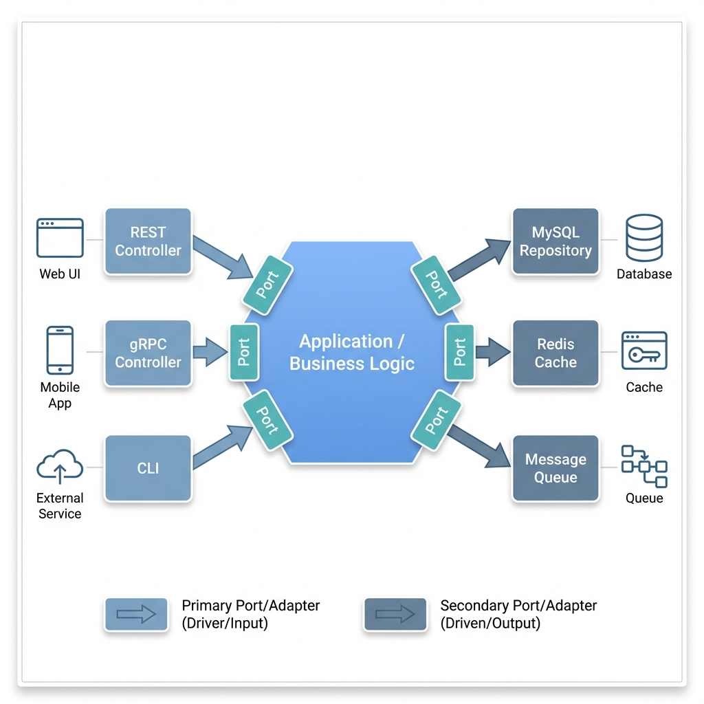

# Project

A shared library built on **Hexagonal Architecture** principles, designed to provide production-ready components that keep your business logic isolated from infrastructure concerns.


## Table of Contents

1. [Why Hexagonal Architecture?](#1-why-hexagonal-architecture)
2. [Core Concepts](#2-core-concepts)
   1. [Application](#21-application)
   2. [Ports](#22-ports)
   3. [Adapters](#23-adapters)
   4. [Actors](#24-actors)
3. [Project Structure](#3-project-structure)
4. [Benefits](#4-benefits)


## 1. Why Hexagonal Architecture?

When developing microservices, we often face these challenges:

| Problem | Consequence |
|---------|-------------|
| **Tight Coupling** | Changing database or framework requires rewriting business logic |
| **Hard to Test** | Business logic is tangled with HTTP handlers, making unit tests painful |
| **Tech Lock-in** | Switching from MySQL to PostgreSQL, or REST to gRPC, becomes a nightmare |
| **Inconsistent Patterns** | Each service invents its own error handling, response format, validation |

**Hexagonal Architecture** (also known as *Ports and Adapters*) solves these by enforcing a clear separation between:
- **What** your application does (business logic)
- **How** it communicates with the outside world (adapters)


## 2. Core Concepts



### 2.1. Application

The **core** of your service. It contains pure business logic with no knowledge of databases, HTTP, or any external technology. This isolation means:
- Business rules are easy to understand and modify
- Logic can be tested without spinning up infrastructure
- The same logic can be reused across different interfaces

### 2.2. Ports

Ports are **contracts** (interfaces) that define how the application communicates with the outside world. There are two types:

| Type | Direction | Purpose |
|------|-----------|---------|
| **Primary Port** (Driver) | Inbound → | Defines what the application **offers** (use cases, handlers) |
| **Secondary Port** (Driven) | ← Outbound | Defines what the application **needs** (repositories, caches) |

> **Why interfaces?** They allow you to swap implementations without touching business logic. Need Redis instead of Memcached? Just implement a new adapter.

### 2.3. Adapters

Adapters are **concrete implementations** that connect ports to real technology:

- **Primary Adapters**: REST controllers, gRPC handlers, CLI commands — they *drive* the application
- **Secondary Adapters**: MySQL repository, Redis cache, Kafka producer — they are *driven* by the application

### 2.4. Actors

Anything outside your application boundary:
- **Driver Actors**: Web UI, Mobile App, External Services — they initiate requests
- **Driven Actors**: Databases, Caches, Message Queues — they respond to requests


## 3. Project Structure

This directory tree illustrates how the project is organized to support the Hexagonal Architecture:

```text
go-common/
├── cmd/
│   └── server/   # Entry point to start the application server.
├── config/       # Configuration files and structure definitions.
├── global/       # Shared global instances (e.g., logger, validator) used across the app.
├── internal/
│   ├── adapters/ # Concrete implementations of ports (REST, gRPC, DB adapters).
│   ├── core/     # Pure domain logic and services.
│   ├── ports/    # Interface definitions for core business logic.
│   ├── di/       # Dependency injection wiring.
│   ├── infrastructure/    # Infrastructure initialization.
├── scripts/      # Automation scripts
└── pkg/          # Public shared library 
```

> **[Explore the Shared Library Documentation](pkg/README.md)**


## 4. Benefits

### Isolation

Components are decoupled through interfaces. Changing the cache from Redis to Memcached doesn't touch your business logic — you implement a new adapter and swap it.

### Flexibility

Technology choices become reversible decisions. Start with MySQL, migrate to PostgreSQL later. Expose REST now, add gRPC when needed. The core remains untouched.

### Testability

Business logic has no dependencies on infrastructure. Unit tests run fast with mock adapters. Integration tests can use testcontainers for real infrastructure.

### Maintainability

Clear boundaries mean multiple developers can work in parallel. One team builds the REST adapter while another implements the Kafka consumer — both depend only on the same port interface.
